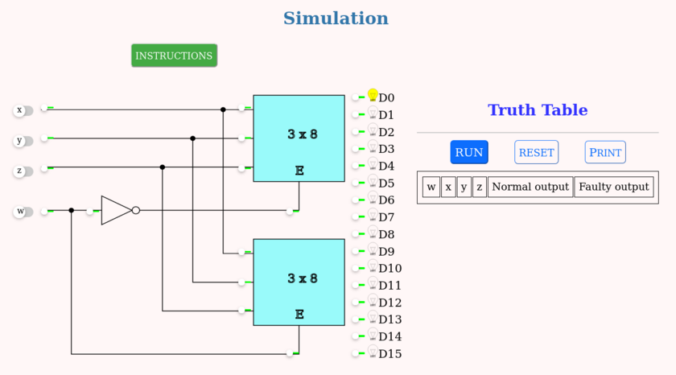

### Procedure

- The circuit simulated is as shown in the below image
- Click the input switches to select the required inputs named "x", "y", "z" and "w". Switch in the "ON" state is
  

 and "OFF" state is
  

- The simulation will display corresponding output. Output is displayed as a glowing bulb
- Press the "RUN" button to display the output in the truth table. Verify the input values and corresponding
  output values from the truth table
- "reset" button clears all entries of truth table and resets the simulator
- At specific positions, small switches make the lines stuck-at-0. Clicking them simulates SA0 faults at the
  said locations. Line is stuck-at-0 if 

. The line is
  normal if switch is green 

- Repeat above steps for all possible inputs and verify the truth table.

The simulation should be displayed as shown:

